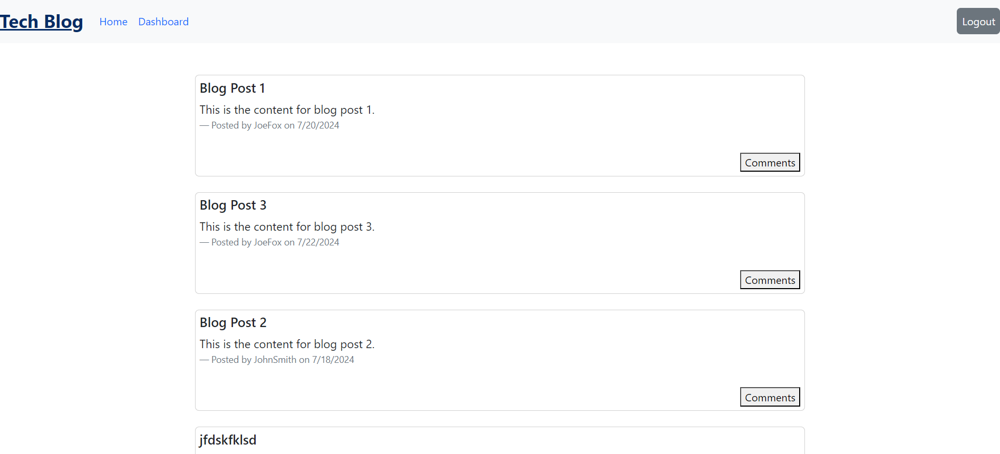
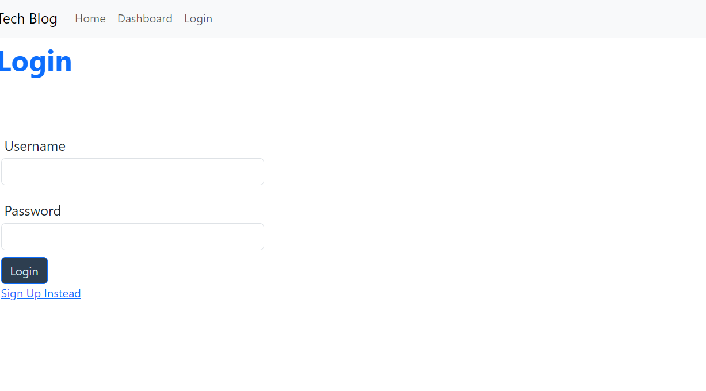
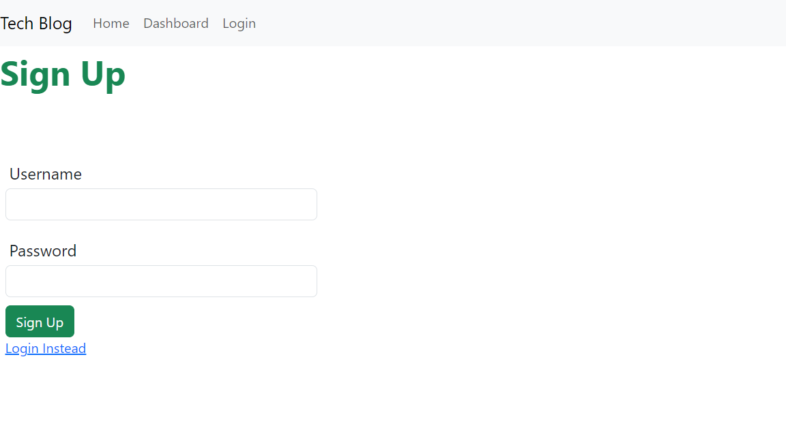
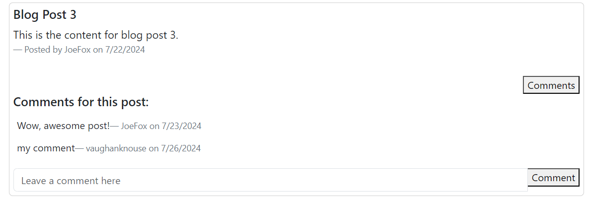

# MVC Tech Blog


## Description ***


## Table of Contents

- [MVC Tech Blog](#mvc-tech-blog)
  - [Description \*\*\*](#description-)
  - [Table of Contents](#table-of-contents)
  - [User Story](#user-story)
  - [Acceptance Criteria](#acceptance-criteria)
  - [Technologies Used](#technologies-used)
  - [Features](#features)
  - [Installation](#installation)
  - [Usage](#usage)
    - [Screenshots: \*\*\*](#screenshots-)
  - [Tests](#tests)
  - [Links \*\*\*](#links-)
  - [Credits](#credits)
  - [License](#license)
  - [Questions](#questions)

## User Story

```md
AS A developer who writes about tech
I WANT a CMS-style blog site
SO THAT I can publish articles, blog posts, and my thoughts and opinions
```

## Acceptance Criteria

```md
GIVEN a CMS-style blog site
WHEN I visit the site for the first time
THEN I am presented with the homepage, which includes existing blog posts if any have been posted; navigation links for the homepage and the dashboard; and the option to log in
WHEN I click on the homepage option
THEN I am taken to the homepage
WHEN I click on any other links in the navigation
THEN I am prompted to either sign up or sign in
WHEN I choose to sign up
THEN I am prompted to create a username and password
WHEN I click on the sign-up button
THEN my user credentials are saved and I am logged into the site
WHEN I revisit the site at a later time and choose to sign in
THEN I am prompted to enter my username and password
WHEN I am signed in to the site
THEN I see navigation links for the homepage, the dashboard, and the option to log out
WHEN I click on the homepage option in the navigation
THEN I am taken to the homepage and presented with existing blog posts that include the post title and the date created
WHEN I click on an existing blog post
THEN I am presented with the post title, contents, post creator’s username, and date created for that post and have the option to leave a comment
WHEN I enter a comment and click on the submit button while signed in
THEN the comment is saved and the post is updated to display the comment, the comment creator’s username, and the date created
WHEN I click on the dashboard option in the navigation
THEN I am taken to the dashboard and presented with any blog posts I have already created and the option to add a new blog post
WHEN I click on the button to add a new blog post
THEN I am prompted to enter both a title and contents for my blog post
WHEN I click on the button to create a new blog post
THEN the title and contents of my post are saved and I am taken back to an updated dashboard with my new blog post
WHEN I click on one of my existing posts in the dashboard
THEN I am able to delete or update my post and taken back to an updated dashboard
WHEN I click on the logout option in the navigation
THEN I am signed out of the site
WHEN I am idle on the site for more than a set time
THEN I am able to view posts and comments but I am prompted to log in again before I can add, update, or delete posts
```

## Technologies Used
- **Node.js**: JavaScript backend runtime environment for building server-side applications.
- **Express.js**: Framework for building web applications and handling routes.
- **Sequelize**: Object-Relational Mapping (ORM) package system for PostgreSQL database management including interacting with the PostgreSQL database, managing models, and handling migrations.
- **pg**: Package to connect to a PostgreSQL database for your Models.
- **PostgreSQL**: Relational database management system for storing user data, blog posts, and comments.
- **Handlebars.js**: Templating engine for rendering dynamic HTML views.
- **express-session**: Middleware npm package for handling user authentication and managing user sessions.
- **connect-session-sequelize**: Package for storing session data in the PostgreSQL database as a cookie.
- **bcrypt**: Library package for hashing passwords securely.
- **dotenv**: Package for managing environment variables.
- **express-handlebars**: Package to implement Handlebars.js for your Views.


## Features
- **User Authentication**: Secure sign-up, log in, and log out functionality to manage user sessions.
- **Blog Management**: Users can create, edit, and delete their blog posts easily. 
- **Comment System**: Users can engage with posts through comments, fostering community interaction.
- **Dynamic Rendering**: Utilizes Handlebars.js for a responsive and user-friendly interface, rendering blog content dynamically.
- **Deployment to Render**: Application is deployed to Render, ensuring it is accessibly online for users to engage with the content.


## Installation

To install the MVC Tech Blog, follow the following steps:

1. Clone the repository to your local machine: `git clone https://github.com/vaughanknouse/MVC-Tech-Blog.git`.
2. Ensure that the current version of Node.js is installed.
3. Open the cloned repository in a CLI, such as Visual Studio Code.
4. Navigate to the project directory in your terminal.
5. Initialize a project with `package.json` by typing `npm init -y` in the terminal.
6. Install the necessary dependencies by typing `npm install` in the command line to ensure that the `node-modules` folder is operating on your local device and that a `package-lock.json` file is present.
7. To set up environment variables, create a `.env` file in the root directory and update your database credentials correctly.
8. Ensure that PostgreSQL is installed on your computer to initialize the database.


## Usage

To use the MVC Tech Blog, follow the following steps:

1. Open the Postgres Shell by typing the command `psql -U postgres` in the terminal.
2. Enter your user database password.
3. Create the `blog_db` database by typing the command `\i db/schema.sql` in the terminal.
4. Close out of the Postgres Shell by entering `\q` in the terminal.
5. Seed the database by typing the command `node seeds/seed.js` in the terminal.
6. Once your PostgreSQL database is active, navigate to the project directory and start the application locally by typing `node server.js` in the terminal.
7. If everything was installed and runs correctly, you should be able to access the blog locally by navigating to http://localhost:3001/ in your browser.
8. Once the blog application is accessed, register an account or log in if you already have one in order to create blog posts and comment on other user's posts. 
9. When the Homepage option is clicked in the navigation, the Homepage with all the existing blog posts including their title, content, author, date created, and comments can be viewed. 
     - The ability to add a comment to a post is also available on the Homepage when a user is logged in.
10. When the Dashboard option is clicked in the navigation, the Dashboard with any blog posts you created can be viewed along with an option to add a new blog post, edit an existing post, or delete a post.
11. If the logout button is clicked or you are idle on the site for more than 30 minutes, you will be logged out of the application and redirected to the login page.


### Screenshots: ***

The following screenshot demonstrates the application's functionality and appearance:

**Image of the application's homepage with an example blog post:**



**Image of the application's Login page:**



**Image of the application's Sign Up page:**



**Image of the application's ability to comment on an existing blog post only when a user is signed in:**




## Tests

There is no unit testing written for this application.


## Links ***

GitHub Repository: https://github.com/vaughanknouse/MVC-Tech-Blog

Deployed Application Link: ***


## Credits

Used the following sources as tutorials and guidelines:

npm documentation on Express Handlebars: https://www.npmjs.com/package/express-handlebars

Handlebars.js documentation: https://handlebarsjs.com/guide/#what-is-handlebars

MDN Web Docs on MVC: https://developer.mozilla.org/en-US/docs/Glossary/MVC

express-session Official README: https://github.com/expressjs/session#cookie

ChatGPT: https://chatgpt.com/?oai-dm=1

Also utilized the Xpert Learning Assistant for some portions of my code:
https://bootcampspot.instructure.com/courses/5293/external_tools/313


## License

This project is licensed under the MIT license. For more information, please visit [this link](https://opensource.org/licenses/MIT).


## Questions

For any questions or feedback, please contact me via email at vaughanknouse@gmail.com.

Additionally, you can find me on GitHub at [vaughanknouse](https://github.com/vaughanknouse).
